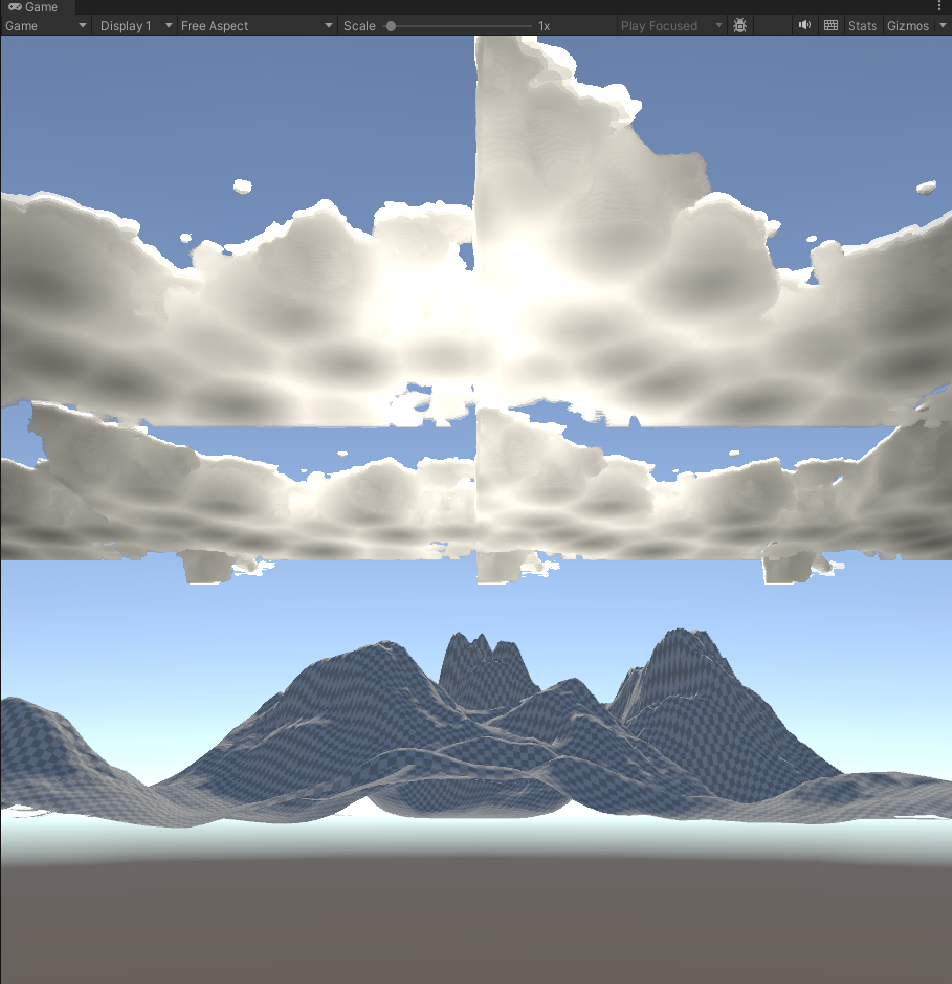
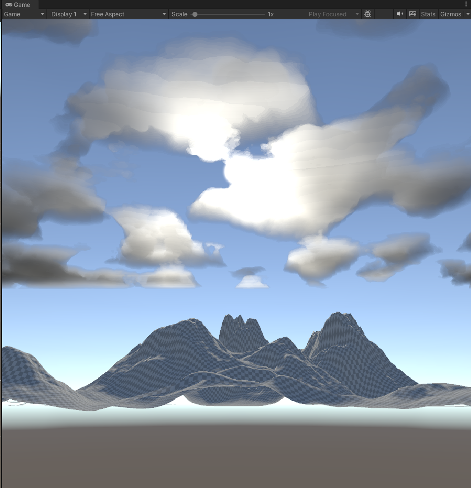

# Volumetric Cloud Renderer

A real time volumetric cloud renderer that is built in Unity 2022.3 as part of 
my final year BSc Computer Science project.

## Goal
This project aims to create a volumetric cloud rendering system from scratch. It
is inspired by the Presentation delivered by Andrew Schneider and Nathan Vos
["The Real Time Volumetric Cloudscapes of Horizon: Zero Dawn"](https://d3d3g8mu99pzk9.cloudfront.net/AndrewSchneider/The-Real-time-Volumetric-Cloudscapes-of-Horizon-Zero-Dawn.pdf), which uses 
Perlin-Worley noise generation through to raymarching to render
cloud volumes that look realistic without unacceptable performance trade-offs.

## Methodology
My approach will start with the very fundamental 2D concepts and expand into
full volumetric rendering in incremental stages. Both a texture based (CPU) approach
and a procedural (GPU) approach have been implemented to compare trade-offs in terms of
performance (FPS, load times) and visual fidelity.

## Progress

### Texture Based Implementation (Main branch)
1. 2D Worley noise generation
2. Worley noise tiling to eliminate seams when textures repeat
3. Cellular Worley noise optimisation (Worley, 1996)
4. A slice viewer to inspect volumes
5. Post processing using OnRenderImage
6. Ray box intersection using the slab method (Kay et al, 1986)
7. Raymarching with density sampling the 3D noise texture
8. Beer-Lambert Transmittance (Edinburgh Instruments, 2021)
9. Light marching with opacity/brightness accumulation
10. Sun colour tinting
11. Henyey-Greenstein light scattering (Hillaire, 2016)
12. World space noise sampling for cloud volume scaling
13. Perlin noise generation
14. Perlin-Worley noise combination
15. Fractal Brownian Motion noise layering
16. Texture caching for load time benchmarking

### Procedural GPU Implementation (procedural branch)
1. Worley noise GPU procedural generation in shader
2. Perlin noise GPU procedural generation in shader
3. Cloud animation with wind speed slider
4. Volume boundary smoothing
5. Quality presets (Low/Medium/High) for performance benchmarking

## Screenshots



## How to Install
1. Clone the repository

```bash
git clone https://github.com/ldarnbr/volumetric-cloud-renderer.git
```

2. Open Unity Hub
3. Click Add -> Add project from disk -> select the 'volumetric-cloud-renderer' folder.
4. Select the project to open!

## Project Settings
### Implementation Switch
Both implementations will load in by default. These are both attached to the main camera. To see one implementation and not
the other, follow these steps:

1. Select **Main Camera** in the Hierarchy
2. Enable the **CloudRenderer** component with the checkbox in the inspector to enable the texture based clouds
3. Disable the **CloudRendererProcedural** component with the checkbox
4. Press Play
5. Repeat to change which implementation is shown

### Resetting the Texture Cache
The texture approach caches the generated textures for performance. If you wish to regenerate the texture to see the
load times output in the console, follow these steps:

1. Select **Main Camera** in the Hierarchy
2. In the **CloudRenderer** component, right click the component header
3. Select **Clear Texture Cache**
4. The textures will regenerate in the next frame and the time taken for each of the Worley and Perlin noise generation will be output to the console.

### Quality Presets (procedural only)
Select **Low**, **Medium** or **High** from the **Quality Preset** dropdown on the **CloudRendererProcedural** component. This controls the step size and step limit in both the density and light marcher, overall increasing the visual fidelity at the cost of performance.

## Cloud Control Parameters
There are a number of sliders to play around with the look of the clouds, ill provide a brief description for each one here but the effects are dramatic enough to be self explanatory if you play around with them in Unity.

Absorption Coefficient - Controls how much light the cloud absorbs via Beer-Lambert transmittance (Higher = Darker)
Density Threshold - The minimum noise value to contribute to cloud density (Higher = More gaps between clouds)

Scatter Factor - Controls forward light scattering via Henyey-Greenstein scattering. (Higher = Stronger silver lining when the Sun is behind the clouds)

Cloud Scale - Controls the size of the cloud features in world space. (Higher = Smaller clouds)

Octave Count - Number of FBM layers (Higher = More detailed cloud edges)

Wind Speed - Controls how fast the clouds are moving using an offset to the noise sample coordinates

## Additional Material
For more complicated concepts, i've included a folder with graphic(s) inside.
These will be referenced in comments of my code directly to help illustrate
what the code aims to achieve. These will be cited below, along with other
references used to implement the various algorithms/approaches I went with.

## References
